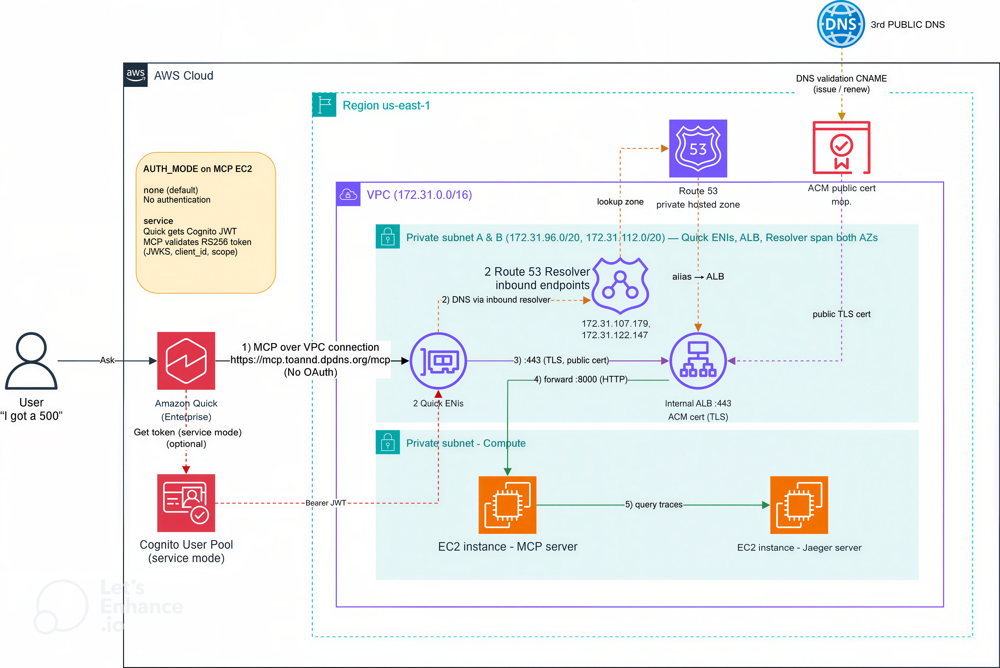

# Private MCP Server + Amazon Quick (VPC Connection)

Cho Amazon Quick gọi được một **MCP server nằm hoàn toàn trong VPC** qua một
**Quick VPC connection** — TLS vẫn hợp lệ nhưng dữ liệu không bao giờ rời mạng
nội bộ. Ý tưởng cốt lõi: **public cert + private DNS**.

Use case minh hoạ: incident response — hỏi assistant "tôi bị lỗi 500" và nó
query Jaeger để trả về root cause.



## Cấu trúc thư mục

```
Quick-MCP/
├── terraform/          # Hạ tầng: VPC, subnet, NAT, ALB, ACM, Route53,
│                       # resolver inbound, Quick VPC connection, Cognito (OAuth)
├── jaeger-mcp-server/  # MCP server (FastAPI) — code đẩy lên repo riêng:
│                       # github.com/toannd021104/jaeger-mcp
├── docs/               # Tài liệu
│   ├── CONSOLE-GUIDE.md  # Dựng từng bước trên AWS Console + giải thích vì sao
│   ├── DEMO-SCRIPT.md    # Kịch bản demo
│   ├── NOTES-QA.md       # Hỏi đáp: vì sao cần từng thành phần
│   └── architecture.jpg
└── slides/             # Slide thuyết trình (Marp)
    ├── SLIDES.md            # Kỹ thuật (Step 1→4)
    ├── SLIDES-SOLUTION.md   # Thuyết trình giải pháp
    └── assets/              # PNG sơ đồ + deck đã render (pdf/pptx/html)
```

## Kiến trúc tóm tắt

```text
User → Amazon Quick
   │  Quick VPC connection (ENI trong private subnet)
   ▼
[VPC]
   Quick ENI ─ DNS ─► Route53 Resolver inbound ─► Private hosted zone ─► IP ALB
            └ HTTPS ─► Internal ALB (TLS, ACM cert) ─► MCP server :8000 ─► Jaeger
```

## Dùng Terraform

```bash
cd terraform
terraform init
terraform apply   # đặt AWS_PROFILE hoặc sửa provider trong versions.tf
```

> Lưu ý: cấu hình dùng placeholder (`mcp.example.com`, `<AWS_ACCOUNT_ID>`).
> Thay bằng giá trị thật của bạn trước khi apply. ACM cert cần thêm bản ghi
> CNAME validation tại DNS provider của bạn.

## Tài liệu chi tiết

- Dựng trên Console: [docs/CONSOLE-GUIDE.md](docs/CONSOLE-GUIDE.md)
- Hỏi đáp thiết kế: [docs/NOTES-QA.md](docs/NOTES-QA.md)
- MCP server source: [github.com/toannd021104/jaeger-mcp](https://github.com/toannd021104/jaeger-mcp)
