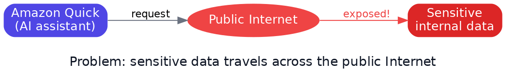
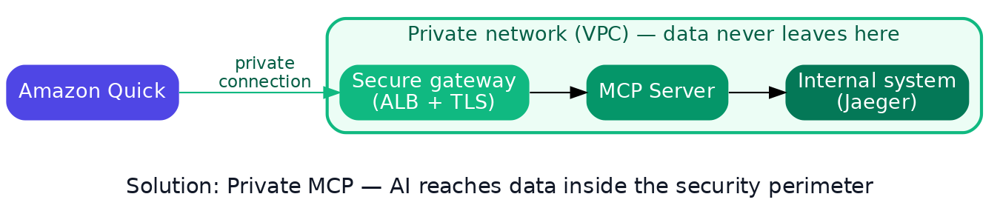
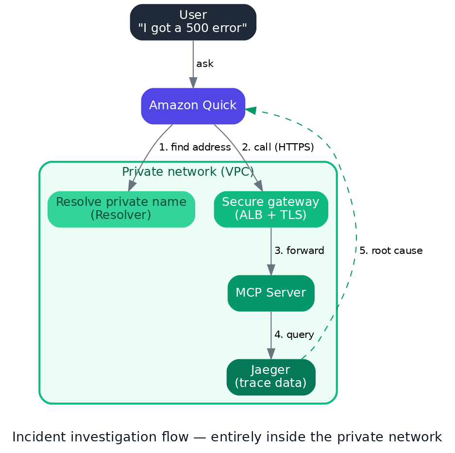
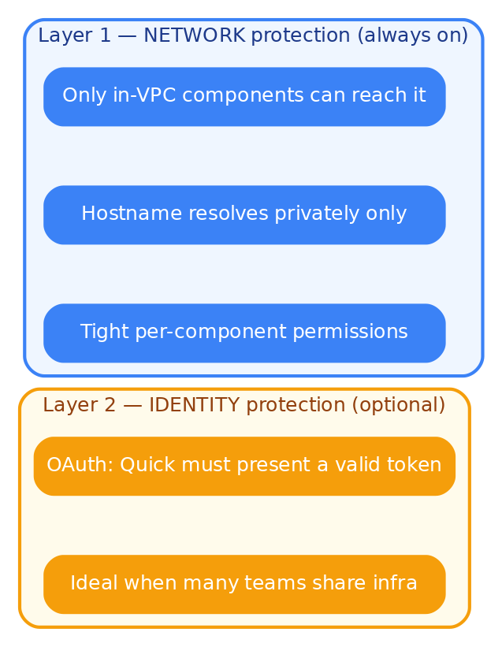

<!-- _class: lead -->

# Securely Connecting Amazon Quick to Internal Systems

### Private MCP Connection — bringing AI inside the enterprise security perimeter

*The AI assistant uses sensitive data, yet the data never leaves the private network.*

---

## Agenda

1. **Context** — Amazon Quick and the MCP connector
2. **The Problem** — why we can't expose internal data
3. **The Solution** — Private MCP Connection
4. **How It Works** — the request flow
5. **Use Case** — incident investigation
6. **Business Value** — what we gain
7. **Layered Security** — network + identity
8. **Why This Approach** — vs. alternatives
9. **Summary & Next Steps**

---

## Context

**Amazon Quick** is an enterprise AI assistant: search data, build agents, automate workflows.

Quick connects to external systems through the **MCP connector**.

But many critical systems live **inside a private network**:

- Internal databases
- Monitoring / logging systems
- Custom operational tools

> **How can AI use this data without exposing it to the Internet?**

---

## The Problem

Opening a public endpoint for the AI to call introduces:

- Sensitive data traveling over public paths
- A larger attack surface
- Difficulty meeting data-security compliance

---

## The Solution: Private MCP Connection

**Two core principles:**

- **Public certificate** → connection is properly encrypted (valid TLS)
- **Private hostname** → only visible inside the internal network

→ AI can use the data; the data **never leaves**.

---

## How It Works

The entire flow stays **inside the private network** — no hop touches the public Internet.

---

## Use Case: Incident Investigation

**Scenario:** A customer reports *"I got a 500 error at checkout."*

| Before | With this solution |
|--------|---------------------|
| Engineers dig through many logs | Ask Quick in plain language |
| Time-consuming | Quick calls MCP inside the private net |
| Easy to miss things | Root cause found automatically |

> Result: *"The payment service timed out calling the bank API"* — in seconds.

---

## Business Value

| Aspect | Benefit |
|--------|---------|
| **Security** | Data never leaves the network; no public endpoint |
| **Compliance** | Meets sensitive-data isolation requirements |
| **Speed** | Natural-language incident response, instantly |
| **Simplicity** | Standard networking the team already knows |
| **Cost** | Fewer moving parts, no extra data-processing fees |

---

## Layered Security

Network isolation is the **always-on** foundation; identity (OAuth) is an **optional** layer when needed.

---

## Why This Approach

Compared with going through a managed gateway service:

- **Fewer components** → easier to operate, fewer failure points
- **No public ingress** → better security by default
- **Amazon Quick's first-class path** → stable and supported
- **Flexible authentication** → run with no auth (network isolation) or enable OAuth

---

<!-- _class: lead -->

# Summary

### More useful AI — it works with real data
### Safer data — it never reaches the Internet
### Simpler operations — standard networking

**AI meets data, securely.**
